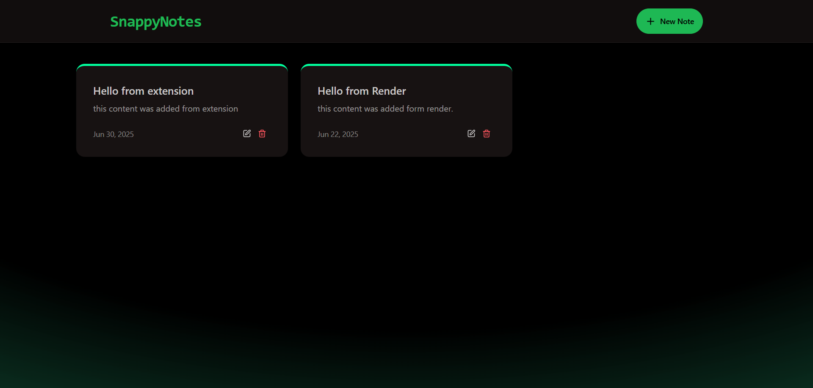
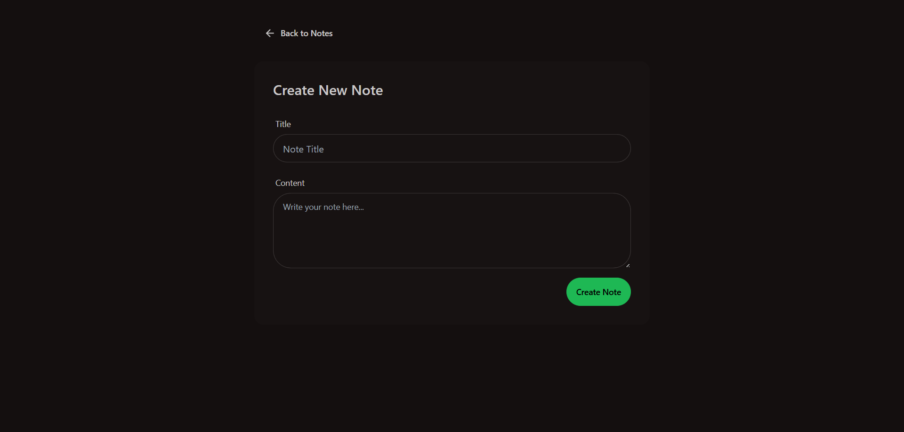
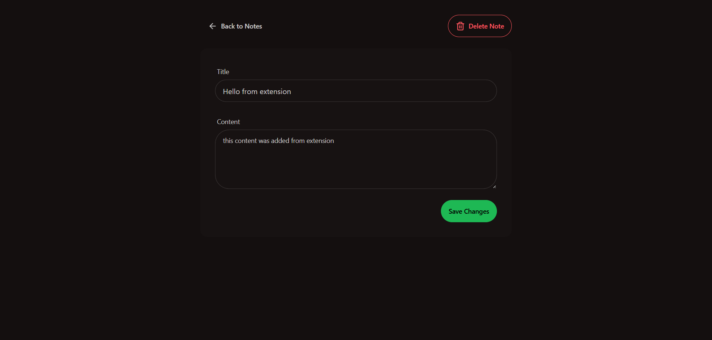
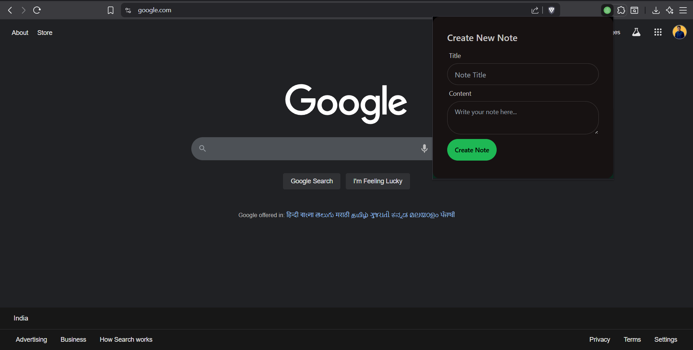

# SnappyNotes

SnappyNotes is a full-stack note-taking application that allows users to quickly create, view, edit, and delete notes. It features a modern web interface, a RESTful backend, and a Chrome extension for instant note capture from your browser.

---

## Features

- 📝 **Create, view, edit, and delete notes**
- 🚦 **Rate limiting** to prevent abuse
- 🌐 **RESTful API** with Express and MongoDB
- ⚡ **Modern React frontend** with Tailwind CSS & DaisyUI
- 🧩 **Chrome extension** for quick note creation from any tab
- ☁️ **Deployed-ready** (supports both local and cloud environments)

---

## Technologies Used

### Frontend
- **React** (with Vite for fast development)
- **Tailwind CSS** & **DaisyUI** (UI styling)
- **React Router DOM** (routing)
- **Axios** (API requests)
- **Lucide React** (icons)
- **React Hot Toast** (notifications)

### Backend
- **Node.js** & **Express** (REST API)
- **MongoDB** (data storage, via Mongoose)
- **@upstash/ratelimit** & **@upstash/redis** (rate limiting)

### Chrome Extension
- **Manifest V3**
- **Vanilla JS** (popup logic)
- **Tailwind CSS** & **DaisyUI** (styling)

---

## Screenshots

### Dashboard


### New Note Page


### Note Detail Page


### Extension


---

## Quick Start

### Prerequisites
- Node.js (v18+ recommended)
- npm
- MongoDB (local or cloud)

### 1. Clone the repository
```bash
git clone https://github.com/vedant115/SnappyNotes.git
cd Note_App
```

### 2. Install dependencies
```bash
# Install backend dependencies
cd backend
npm install

# Install frontend dependencies
cd ../frontend
npm install
```

### 3. Set up environment variables
- Copy `.env.example` to `.env` in the `backend` folder and fill in your MongoDB URI and other secrets.

### 4. Start the backend server
```bash
cd backend
npm run dev
```

### 5. Start the frontend
```bash
cd ../frontend
npm run dev
```

### 6. Load the Chrome Extension
- Go to `chrome://extensions/` in your browser
- Enable "Developer mode"
- Click "Load unpacked" and select the `extension` folder
